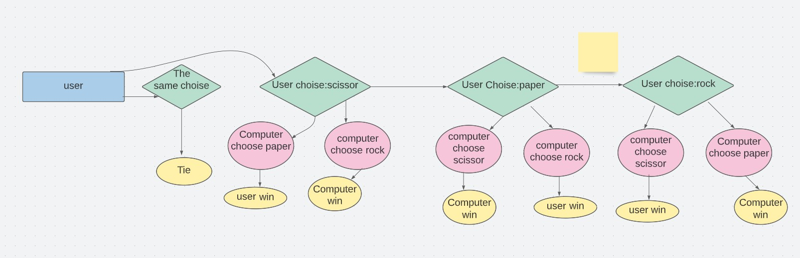

# Rock, paper and scissor game
This is the classical game of rock, paper, scissor. Perfect to play when you have a small brain-break from work or school. You dont have to put alot of energy on this game but it will still keep you interested an curios about what the computer will answer.

## User Stories
User can choose to write either rock, paper and scissor and the computer will randomly choose an answer at the same time. The game is easy: scissor beats paper, paper beats rock and rock beats scissor. The user can, after every round, choose to end the game or keep on going.

### User inputs an answer, the choises are provided in the input string.
 

 

### The same code validets user answer and if its not in the options, user will get an error message and the game restarts
 

 

### When the result arrives with the winner, user can choose to keep on playing('y') or end the game ('n')
 

## Features

### Existing features
* User can only choose between rock, scissor and paper or a message will appear telling the user to choose again.
* Computer chooses random between the options
* User input
* User can not see what computer will randomly choose before the user makes his/hers choise
* User can choose to end game after every round

### Future features
* Make a scoreboard 
* Make the player beeing able to choose to play "Best of three"

## Charts
### Flowchart that explains the game

### Flowchart that explaines the codes

## Testing
* Testing in the PEP8 Online check, came back without errors
* Tested in code Instution herouk app

### Bugs
* I did not put the two codes in the right intendetnt block. This made my game only work as it should until the main() function. The program would only ask you to choose an answer and nothin more would happend. I noticed the error when I saw the wrong outcome of the game in the terminal. The error was detected by following the function path in the game. The game stoped working after the user_choise but the computer_choise function was correct. The only thing remaning was that the main function did not read the user_choise nor the computer_choise.
 

### Unfixed Bugs
* No unfixed bugs

## Validation
* PEP8: No errors returned

## Delpoyment
Delpoyd with Code instutions mocterminal in Herouk
* Creat herouk app
* Set buildback python and NodeJS(in that order)
* Link Herouk app with repositery
* Deploy

## Credits
* Code for to user to being able to end game provided by Mentor Rohit, line 25,26,50,51,52
